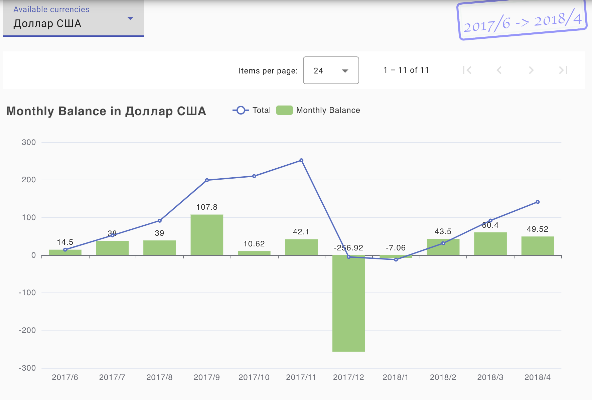
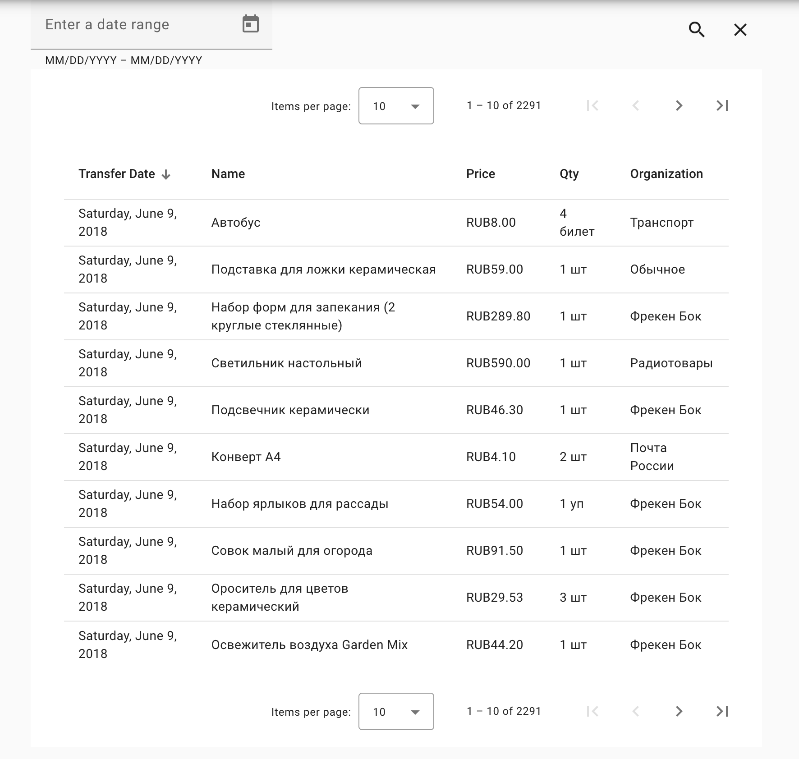

# Money Tracker UI

[](https://github.com/grauds/money.tracker.ui/actions/workflows/docker-image.yml)


[Money Tracker](https://dominsoft.ru) application helps with daily financial activities logging and provides insights to different budget areas like spendings, profits, incomes, commodities, loans and credits, trade organizations and commodities. The data is stored in its database which is shared with this web applications therefore the web application is capable of getting a fresh copy of data and displaying additional reports and insights.

 
## Quick Start

### Dependencies

This application depends on two other backend projects [Clematis Auth API](https://github.com/grauds/clematis.auth.api) and [Clematis Money Tracker API](https://github.com/grauds/money.tracker.api). Please refer to these projects' documentation to learn how to install them first. 

Once the mentioned backends are running, this application's configuration has to be updated with the new backend URLs.

1. Add another nginx configuration file to [jenkins folder](https://github.com/grauds/money.tracker.ui/blob/df2b918ebf492087f5431b7f42ce43f933b9d6a0/apps/money-tracker-ui/jenkins), better by copying the existing one:

```Bash
cp nginx-default.conf nginx-custom.conf
```
2. Provide the following addresses and ports in 'nginx-custom.conf':
```NGINX
      location ~* ^/auth/ {
           proxy_http_version 1.1;
           proxy_pass http://[Clematis-Auth-API-IP-Address]:[Auth-API-Port];
      }

      location ~* ^/api/ {
           proxy_http_version 1.1;
           proxy_pass http://[Money-Tracker-API-IP-Address]:[Tracker-API-Port];
      }

      location ~* ^/info/(.*) {
           proxy_http_version 1.1;
           proxy_pass http://[Money-Tracker-API-IP-Address]:[Tracker-API-Port]/$1;
      }
```
3. Create your own docker compose file or change the existing one to provide the new mapping. In some cases it is better to provide an absolute path on the left of the column, for example, if the application is built in a dockerized Jenkins.

```Docker
volumes:
    - ./nginx-custom.conf:/etc/nginx/conf.d/default.conf
```

### Build the image

Checkout the code and run the docker build, assuming that your computer has Docker environment installed:

```
git 'https://github.com/grauds/money.tracker.ui.git'
```
```
docker build . -t money.tracker.ui -f Dockerfile
```

Run the image with Docker compose:
```
docker compose build
```
```
docker compose up -d
```

The application will be available at: http://localhost:18082 provided that the port 18082 is mapped in docker compose


## Development

This is an Angular application with Typescript under the hood, the repository uses [nx](https://nx.dev/). Checkout the code and install node dependencies first:
```
npm install
```

```
nx serve
```
The application will be available at: http://localhost:4200 and will automatically reload if you change any of the source files.

### Code scaffolding

Run `nx generate component component-name` to generate a new component. You can also use `ng generate directive|pipe|service|class|guard|interface|enum|module`. See [Angular Docs](https://angular.io/)

### Build

Run `nx run money-tracker-ui:build:production` to build the project for production. The build artifacts will be stored in the `dist/` directory.

### Running unit tests

Run `nx run-many --target=test --all --coverage` to execute the unit tests

## Jenkins Deployment

Please consult Jenkins documentation on how to configure a Pipeline from Jenkinsfile from the root of the repository. Once configured, it can build and deploy a docker container with the app on the same server this Jenkins is installed on.

## Features

###  Accounts

The page offers overview of accounts assets distribution in currencies registered in the database. The application assumes exchange rates are known for those currencies for each date, if not, the last known rate before the missing date is taken. This rule works for all views where values can be shown in different currencies. 


###  Income


Income report automatically finds the start and end dates when income is registered in the system and shows it as a bar chart. 


###  Balance Monthly

Monthly balance shows how the amount of money changes over time on monthly basis. It is okay for it to go below zero sometimes, which only means that the expenses surpass the available money, which may be the case with loans or credits. Borrowing money usually leads to negative balance numbers.




###  Expenses

It is a simple log of all the operations for the database, sorted by time in descending order. The filter also allows specifying a date range.




###  History

The list of commodities with a slightly different representation - all the commodities here are unique and sorted by the last time they were bought. For unique articles like bycicles or houses it may be a single appearance tens of years back. For periodic items like food or clothing it is usually the places at the top of the list. 


###  Users' commodities

Monthly breakdown of users' contributions to expenses in terms of money and commodities. It is required to be precise with agents attribution to expenses in the Money Tracker application.


###  Currency Exchange

Currency exchange may come in handy to redistribute the money accross different currencies to avoid exchange rate risks. However, it is often not known exactly how successful the operations were. This chart offers simple analysis for this, yielding the sheer profit or loss calculated as the total amount of money spent to buy a currency to the price of that currency now. The screen below shows that is the same amount of dollars was sold now, it would've bought 1,699.11 roubles more, i.e. dollars are more expensive now.


###  Reselling

This chart is useful for those who buy and sell often using the same commodity identifiers. System compares the amount of money for a commodity spent on it with the amount of money received in a operation like reselling or any other. 

### Lists of commodities, organizations and their groups 

The lists of all registered resources with clickable links leading to individual pages for commodities, organizations and their groups.


###  About

This page is available without authentication and shows basic, not sensitive statistic information about the database itself, last update date of financial information, some numbers around quality of the data: missing trade places or commodities.


