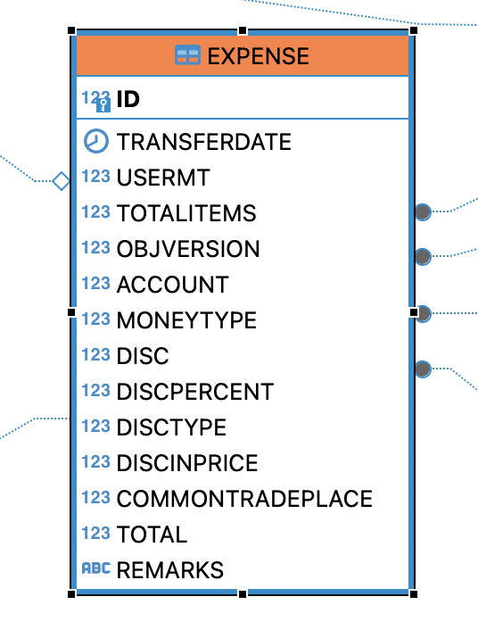

# Model library

This library contains classes to reflect data structure - views and tables on the backend to show in lists and DTO classes for specific data aggregation to show in charts.

## Class structure

The base class for database bound classes is Entity:

```typescript
import { Resource } from '@lagoshny/ngx-hateoas-client';
import { Utils } from '../utils/utils';

export class Entity extends Resource {

  name: string | undefined;

  static getRelativeSelfLinkHref<T extends Resource>(resource: T | undefined): string {
    if (resource) {
      return Utils.parseResourceUrlToAppUrl(Utils.removeProjection(resource.getSelfLinkHref()));
    } else return ''
  }

  static getRelativeLinkHref(resource: string): string {
    if (resource) {
      return Utils.parseResourceUrlToAppUrl(resource);
    } else return ''
  }
}

```

Entity extends Resource class from [Lagoshny Angular Hateoas library](https://github.com/lagoshny/ngx-hateoas-client). This brings in some implications on the model code:

1. Application is dependent on external library
2. Application has a contract with backend to exchange data in HATEOAS format for all table data (not for DTO)
3. Entity class uses utility conversion of resource URL from HATEOAS to the application URL of the resource page, thus mapping resource pages to their backend URLs.

For example, the following resource

```http
http://192.168.1.118:18085/api/expenseItems/47/tradeplace
```

becomes a relative address in the application

```http
/expenseItems/47/tradeplace
```

## Define resource classes

Let's say we have a remote table which looks like the following:



The data from the table can be queried from the REST HATEOAS backend as:

````cURL
curl --location 'http://192.168.1.118:18086/api/expenses' 
````

And the result in HATEOAS would be like below (items are omitted for brevity):

````json
{
    "_embedded": {
        "expenses": [
            {
                "transferdate": "2017-06-15T00:00:00.000+00:00",
                "totalitems": 10.5,
                "disc": 0.0,
                "discpercent": 0.0,
                "disctype": null,
                "discinprice": 0,
                "total": 10.5,
                "remarks": null,
                "transferDate": "2017-06-15T00:00:00.000+00:00",
                "_embedded": {
                    "items": [
                      {
                    
                      }
                ]}
            }
        ]
    },
    "_links": {
        "first": {
            "href": "http://192.168.1.118:18086/api/expenses?page=0&size=20"
        },
        "self": {
            "href": "http://192.168.1.118:18086/api/expenses"
        },
        "next": {
            "href": "http://192.168.1.118:18086/api/expenses?page=1&size=20"
        },
        "last": {
            "href": "http://192.168.1.118:18086/api/expenses?page=34&size=20"
        },
        "profile": {
            "href": "http://192.168.1.118:18086/api/profile/expenses"
        },
        "search": {
            "href": "http://192.168.1.118:18086/api/expenses/search"
        }
    },
    "page": {
        "size": 20,
        "totalElements": 681,
        "totalPages": 35,
        "number": 0
    }
}
````

Client library which the application uses will understand the links, page size and total elements, but will also want to create array of instances of Expense class which we should provide:

````Typescript
import { HateoasResource } from '@lagoshny/ngx-hateoas-client';
import { Entity } from "./entity";

@HateoasResource('expenses')
export class Expense extends Entity {

  disc = 0;
  discpercent = 0;
  disctype = '';
  discinprice = 0;
  price = 0;
  remarks = '';
  total = 0;
  totalItems = 0;
  transferDate = '';
  accountLink: string | undefined;
}

````

With inroduction of the resource class the application gets type control, search with pagination and many more features automatically with HATEOAS. More on this topic [Define resource classes](https://github.com/lagoshny/ngx-hateoas-client?tab=readme-ov-file#Define-resource-classes)

## Data transfer objects

Some data is not covered in HATEOAS responses because of its generic format and nature. This is true for many charts and reports. In this case, instead of a class, it is preferable to create an interface in the dto folder, for example:

```typescript
export interface AgentCommodities {

    agent: string;
    commodityGroup: string;
    total: 0;
    mois: number;
    an: number;
}
```
## Running unit tests

Run `nx run model:test` to execute the unit tests via [Jest](https://jestjs.io). However, the tests also can be run in a bundle with the other modules:
```bash
nx run-many --target=test --all --coverage
```

## Running lint

Run `nx lint model` to execute the lint via [ESLint](https://eslint.org/).
