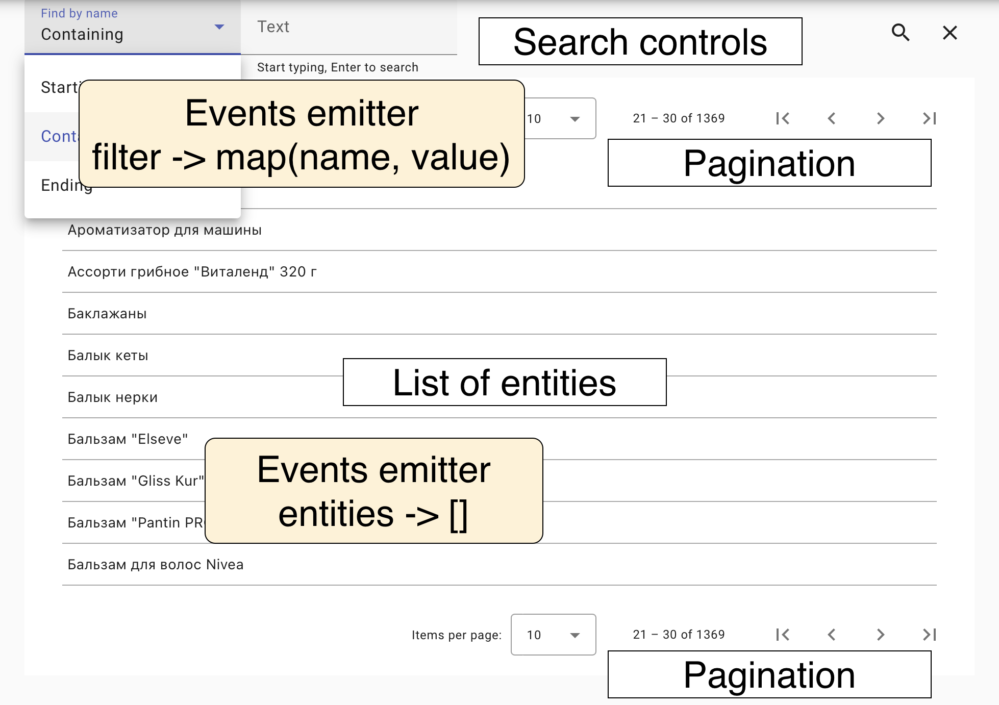

# Shared Components Library

This library contains client services to work with Money Tracker REST backend, basic components for lists of entities, pagination, search and some widgets.

## Search service

Services use inheritance pattern and the base class for all entity services is SearchService, which code is provided below. It is an abstract class and delegates the actual data loading to its descendants. Also, it uses environment service to select the current environment variables set, allows consumers to see the status of data loading by observing `statusDescription$` field (example below) and read loading status using `_pageLoading` field.

```typescript
import { BehaviorSubject, Observable } from "rxjs";
import { PagedResourceCollection, Resource } from "@lagoshny/ngx-hateoas-client";
import { PagedGetOption } from "@lagoshny/ngx-hateoas-client/lib/model/declarations";
import { EnvironmentService } from "./environment.service";

export type SearchPostProcessingHandler<T extends Resource>
  = (res: PagedResourceCollection<T>) => Observable<PagedResourceCollection<T>>;

export abstract class SearchService<T extends Resource> {

  private statusDescription$ = new BehaviorSubject<string>("search")

  private searchPostProcessingHandler: SearchPostProcessingHandler<T> | null = null

  environmentService: EnvironmentService;

  private _pageLoading = false

  protected constructor(environmentService: EnvironmentService) {
    this.environmentService = environmentService;
  }

  abstract searchPage(options?: PagedGetOption, queryName?: string | null) : Observable<PagedResourceCollection<T>>

  abstract getPage(options?: PagedGetOption): Observable<PagedResourceCollection<T>>

  setProcessingStatusDescription(message: string): void {
    this.statusDescription$.next(message)
  }

  getPostProcessingStream(): SearchPostProcessingHandler<T> |null {
    return this.searchPostProcessingHandler
  }

  setPostProcessingStream(handler: SearchPostProcessingHandler<T>): void {
    this.searchPostProcessingHandler = handler
  }

  ...

}
```

The search method is used with search queries names from backend:

```typescript
abstract searchPage(options?: PagedGetOption, queryName?: string | null) : Observable<PagedResourceCollection<T>>
```

For example, it works with Spring Data REST endpoints like below:

```java
@NoRepositoryBean
public interface PagingAndSortingAndFilteringByNameRepository<T extends NamedEntity, ID>
        extends JpaRepository<T, ID> {

    @RestResource(path = "findByNameStarting")
    Page<T> findByNameStartingWithIgnoreCase(@Param("name") String name, Pageable pageable);

    @RestResource(path = "findByNameContaining")
    Page<T> findByNameContainingIgnoreCase(@Param("name") String name, Pageable pageable);

    @RestResource(path = "findByNameEnding")
    Page<T> findByNameEndingWithIgnoreCase(@Param("name") String name, Pageable pageable);

}
```

In this case client code uses 'search by name' with one of the postfixes: 'Starting', 'Containing' or 'Ending', plus the value of the name itself:

```typescript
this.entityList.refreshData({
  queryName: 'findByName' + 'Containing', // the name of the query from the backend
  filterParams: {
    // parameters for the query
    name: 'Sample name',
  },
  queryArguments: getQueryArguments(), // gather all other query arguments
});
```

Where query arguments could be a map including custom query and paging
arguments:

```typescript
  getQueryArguments(): RequestParam {
    return {
      id: 16, // just a dummy argument
      page: 4, // page related info
      size: 15, // size of a page
      sort: 'name:ASC' // sorting order
    }
  }
```

All these arguments are merged into one set of HTTP query arguments further in the code before sending this to the server:

```
/api/lastExpenseItems/search/findByNameStarting?name=Sample%20name&page=4&size=15&sort=name:ASC&id=16
```

### Search results post processing

In many cases it is required to transform the search results or to query additional information from another endpoint. To achieve this use `SearchPostProcessingHandler` instances, any type which has a compatible method:

```typescript
(res: PagedResourceCollection<T>) => Observable<PagedResourceCollection<T>>;
```

For instance, the following method invokes postprocessing and changes status text:

```typescript
  private executePostProcessing(searchResult: PagedResourceCollection<T>): Observable<PagedResourceCollection<T>> {
    const handler = this.searchService.getPostProcessingStream()
    if (handler) {
      this.searchService.setProcessingStatusDescription("Post processing is started...")
      return handler(searchResult)
    }
    return of(searchResult)
  }
```

## Search list component

The component schema is shown below. It has three main layout areas: list of entities, search controls and two pagination bars. Two areas in yellow stand for events emitting ability of the contol so the other controls can listen to changes in the filter bar or in the list of the results shown. In addition to these emitter the control has two more: loading status and loading flag emitters.



The search components also listens for the changes in the browser address bar to update variables it knows about: current page, filter test, size of the page and sorting:

```
http://address:port/commodities?page=2&size=10&sort=name,ASC
```

### Default and customised usage

The default search component is quite capable to provide search with pagination and filtering on its own with no additional parameters:

```xml
<app-search></app-search>
```

Also, some arguments can be given, like templates for result list entries or switch between list and table order:

```xml
<app-search
  [resultItemTemplate]="lastExpensesTable"
  [table]="true">
</app-search>
```

The list of available arguments:

1. resultItemTemplate - to customise the appearance of the list entries
2. filterTemplate - to customise the appearance of the search control
3. table - boolean variable to render the results as a list or a table
4. sort - object of type RestSort
5. queryParamsMode - mode for the query params update in the browser bar: 'merge' or 'preserve'. Choose merge if you need to update the existing address bar parameters or preserve if the parameters from the component are to be added to the exiting ones.
6. loadOnInit - true if the new page is to be retrieved on the page load, if false, it will stay empty.
7. searchRequest - to provide another custom search request instead of the default one which is calculated from HATEOAS Entity class:

```typescript
export class SearchRequest {
  queryName: string | null = null;
  queryArguments: RequestParam = {};
  filterParams?: RequestParam = {};
}
```

## Running unit tests

Run `nx run shared-components:test` to execute the unit tests via [Jest](https://jestjs.io). However, the tests also can be run in a bundle with the other modules:

```bash
nx run-many --target=test --all --coverage
```

## Running lint

Run `nx lint shared-components` to execute the lint via [ESLint](https://eslint.org/).
